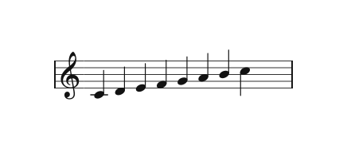

</img>

**M**u**S**emanti**Q** (**MSQ**) is a text language for music. You write music as plain text, and MSQ
draws it as a score (**SVG**) and plays it (**MIDI**). It's plain JavaScript that runs in Node.js
(22 or newer) and in the browser, with no build step and no runtime dependencies.

The text below:

```text
page line width is 300
background color is white

measure
treble clef
1/4 c d e f g a b c5 with stem down
```

rendered as:

</img>

## What MSQ gives you

- **Low-Level API** (`src/api.js`): functions that turn MSQ text into SVG and MIDI.
- **Worker** (`src/worker.js`): the same API in a Web Worker.
- **Web Components** (`web-components/`): `msq-svg`, `msq-midi`, `msq-svg-midi` and
  `msq-editor` show a score, a player or an editor for the MSQ text inside them.
- **Showdown Extensions** (`showdown-extensions/`): turn `msq-…` fenced blocks in markdown
  into web components.
- **Dev tools** (`dev-tools/`):
  - **Test viewer**: shows expected and actual output of every test side by side.
  - **Font viewer**: shows every glyph of a music font.
  - **Font generator**: makes JavaScript font tables from a SMuFL font.
  - **Magenta sound font generator**: makes a sound font for the player.
- **CLI** (`cli-app/`): makes SVG and MIDI files from MSQ text in the terminal.

## Where things are

```
src/
  api.js, worker.js
  language/
    api.js                 parsing only; nothing here imports from outside src/language
    parser/                the parser (see src/language/parser/README.md)
      parseLanguage.js
      scenarios/
        main/              what every command does: the page schema, errors, styles…
        highlight/         the editor's highlights, with ref-ids (an adapter)
        highlight-without-ref-ids/   the same without ref-ids, for typing (an adapter)
    schema/                checks a page schema
    serializer/            parser output back to MSQ text
  drawer/
    elements/              grouped like the MSQ Language part of the docs:
                           notes-on-a-page/, grouping-notes/, the-page/, marks-on-units/,
                           spans/, measure-furniture/, layout-and-styles/,
                           plus basic/ (SVG primitives) and shared/
    generateStyles.js      all the spacing, from the stave line spacing and the font
    font/                  the music fonts as JavaScript tables
    lib/                   vendored opentype.js and svgpath
  midi/                    the page schema as MIDI; vendored @tonejs/midi and midi-file in lib/
web-components/            the msq-* elements and the editor
showdown-extensions/       msq-… fenced blocks in markdown
tools/                     the font and sound font generators
scripts/                   tests, copying, setup and docs scripts (run them with npm)
test/                      visual-tests/, audio-tests/, serializer-tests/
browser-app/               the example app in the browser
cli-app/                   the example app in the terminal
dev-tools/                 the app for working on MSQ itself
docs/                      the landing page and the documentation site
```

`src/` and `web-components/` are copied into every app (`static/js/msq/`). The copies are
not tracked, so edit only the originals. `npm run watch:src` and
`npm run watch:web-components` keep the copies up to date while you work.

## The apps

All three web apps run on [nodes](https://github.com/Guseyn/nodes.js), an HTTP/2 server.
Each one has the same layout in `web-app/`: `main.js` reads `env/local.json` (port, host,
certificate), and `worker.js` declares the routes. The certificates are self-signed, so the
browser warns once.

### browser-app

A small page with the web components: write music, see the score, play it.

```bash
npm run browser-app:setup   # once, and after you change src/ or web-components/
npm run browser-app         # https://127.0.0.1:8888
```

### cli-app

Makes SVG and MIDI files from MSQ text in the terminal. Without arguments it asks a few
questions first.

```bash
npm run cli-app -- --input score.txt --svg --midi
npm run cli-app -- --help
```

See `cli-app/README.md`.

### dev-tools

The app for working on MSQ itself:

- **Test viewer**: every test, with its expected and actual output side by side. You can
  accept the new output as expected from here.
- **Font viewer**: every glyph of a music font. You can tune how it's placed.
- **Font generator**: makes JavaScript font tables from a SMuFL font.
- **Magenta sound font generator**: makes a sound font for the player.

```bash
npm run dev-tools:setup   # downloads nodes, EHTML and e-ui from GitHub (asks first)
npm run dev-tools         # https://127.0.0.1:8889
```

### docs

The landing page (`/`) and the documentation (`/docs/<section>/<page>`).

```bash
npm run docs:vendor   # once: copies nodes, EHTML, e-ui and e-dev from the folders beside this one
npm run docs          # checks the examples, then https://127.0.0.1:8890
```

See `docs/README.md`.

## Tests

The tests compare output with files saved in `expected/`:

- `test/visual-tests/bravura/` and `test/visual-tests/leland/`: SVG, page schema,
  highlights, errors, custom styles, comments
- `test/audio-tests/`: the same, plus MIDI and MIDI settings
- `test/serializer-tests/`: parse → serialize → parse again gives the same result

Each test is a `.txt` file of MSQ. Pages are split by `====next page====`. Every run
writes `actual/`. If the new output is right, copy it over `expected/`, by hand or with the
test viewer in dev-tools.

## Commands

```bash
# tests
npm run test:all                            # visual, audio and serializer tests
npm run test:visual:all                     # also test:audio:all, test:serializer:all
node scripts/visual-tests.js --only=chord   # only the tests with "chord" in the name
npm run coverage                            # the tests with coverage
npm run coverage:check                      # fails below the coverage thresholds

# apps
npm run browser-app:setup && npm run browser-app
npm run dev-tools:setup && npm run dev-tools
npm run docs
npm run cli-app -- --input score.txt --svg --midi

# copying src/ and web-components/ into the apps
npm run setup:symlinks                      # links the fonts into the apps (runs after npm install)
npm run msq:apps:update                     # copies src/ into every app
npm run web-components:update               # copies web-components/ into every app
npm run watch:src                           # keeps copying src/ while you work
npm run watch:web-components                # keeps copying web-components/ while you work
npm run create:msq:worker -- -o static/js/msq/worker   # only the worker, for your own app

# docs
npm run docs:check                          # checks every example in the docs
npm run docs:pipeline                       # redraws the "How it works" pictures on the landing page
npm run docs:art                            # redraws the landing page art
npm run docs:api-example                    # remakes score.svg and score.mid that the Low-Level API page links to
```

## nodes, EHTML, e-ui and e-dev

The apps use four small libraries, each with no dependencies and no
build step:

- [nodes](https://github.com/Guseyn/nodes.js): the HTTP/2 server
- [EHTML](https://github.com/Guseyn/EHTML): page behaviour in HTML (fetching JSON,
  templates, actions). It also ships showdown, which renders the docs.
- [e-ui](https://github.com/Guseyn/e-ui): the design system of dev-tools and the docs
- [e-dev](https://github.com/Guseyn/e-dev) (docs only, locally): open a docs page with
  `?dev=true` and Alt + click an element to open its line in the editor

They are copied into the apps, not installed:

- `dev-tools:setup` downloads them as zips from GitHub.
- The `*:vendor` and `*:update` scripts copy them from checkouts in folders beside this
  one (`../nodes.js`, `../EHTML`, `../e-ui`, `../e-pages`). They replace the copy each
  time, so fix a bug in the library itself, then copy it again.
