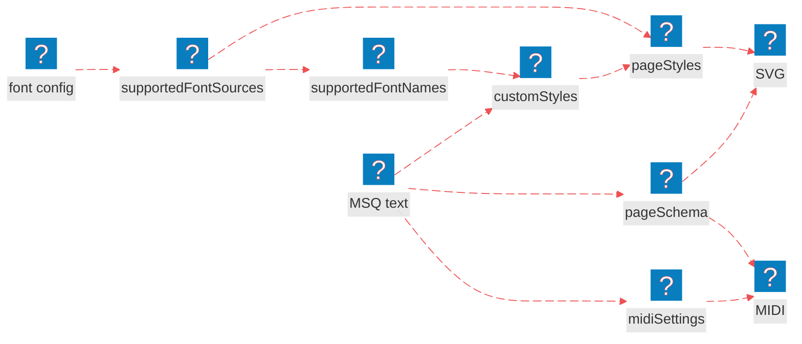

# Low-Level API

<nav is="docs-contents"></nav>

## How It Works

1. **Plain ES modules.** Every file in `src` is a standard module with `import` and `export`, so Node.js and browsers load it as it is.
2. **Import maps.** Inside `src`, modules import each other as `#msq/…`. In Node.js the `imports` are configured in `package.json`, and in the browser `<script type="importmap">` does that.
3. **No build.** No bundler, no transpiler, no `npm install`. You copy `src` and use it.
4. **The same API for the browser and Node.js.** The same functions, the same arguments, the same results. Only the font config differs: file paths in Node.js, URLs in the browser.

Below is a diagram of how the MSQ engine works:

1. We load the fonts declared in the **font configuration**, which gives us the glyph shapes for each font.
2. From the loaded fonts, we take their names, the **supported font names**: the only fonts our MSQ text may choose.
3. From the **MSQ text**, we parse the page structure, or **page schema**, and extract any **custom styles** and **MIDI settings** we have specified. A font chosen in the text must be one of the **supported font names**.
4. The glyph shapes, combined with our **custom styles**, give us the **page styles**.
5. We use the **page schema** and the **page styles** to generate **SVG**.
6. We use the **page schema** and the extracted **MIDI settings** to generate **MIDI**.



## Setup and a Full Example

<e-tabs data-apply-hash-navigation>

<e-tab data-title="Node.js">

<details is="e-details">
<summary>Setup</summary>

First, download MuSemantiQ next to your project:

```sh
# download the main branch as a zip
curl -L https://github.com/Guseyn/MuSemantiQ/archive/refs/heads/main.zip -o MuSemantiQ.zip
# unpack it
unzip MuSemantiQ.zip
# name the folder MuSemantiQ
mv MuSemantiQ-main MuSemantiQ
```

Then copy `src` from `MuSemantiQ` into your project, as the `msq` folder:

```sh
# go to your project
cd your-project
# make the folder for MSQ
mkdir msq
# copy src into it, the fonts included
rsync -a --delete ../MuSemantiQ/src/ msq/
```

Finally, add the imports to your `package.json` and mark the package as a module, so that every `#msq/…` import inside `msq` resolves:

```json
{
  "type": "module",
  "imports": {
    "#msq/drawer/*": "./msq/drawer/*",
    "#msq/language/*": "./msq/language/*",
    "#msq/midi/*": "./msq/midi/*",
    "#msq/api.js": "./msq/api.js"
  }
}
```

</details>

<details is="e-details">
<summary>Full Example</summary>

```js
// render.js

import fs from 'fs'

import {
  setupFonts,
  supportedFontNamesFrom,
  generateIntermediateStructuresForMultiplePages,
  generateStylesForMultiplePages,
  generateSvgForMultiplePages,
  generateMidiForMultiplePages
} from '#msq/api.js'

// the fonts, as paths into your copy
const fontConfig = {
  'chord-letters': {
    'gentium plus': './msq/drawer/font/chord-letters/GentiumPlus-Regular.ttf'
  },
  'text': {
    'noto-serif': {
      'regular': './msq/drawer/font/text/NotoSerif-Regular.ttf',
      'bold': './msq/drawer/font/text/NotoSerif-Bold.ttf'
    }
  },
  'music': {
    'bravura': {
      'font': './msq/drawer/font/music/Bravura.otf',
      'js': '#msq/drawer/font/music-js/bravura.js'
    }
  }
}

// one file per page, in the order of their names: 1.txt, 2.txt, …, 10.txt
const multiplePagesText = fs.readdirSync('pages')
  .sort((left, right) => left.localeCompare(right, undefined, { numeric: true }))
  .map((fileName) => fs.readFileSync(`pages/${fileName}`, 'utf-8'))

// load the fonts once; the only async call
const supportedFontSources = await setupFonts(fontConfig)

// the names of those fonts, which the pages may choose
const supportedFontNames = supportedFontNamesFrom(supportedFontSources)

// parse every page; a mistake is reported, never thrown
const {
  pageSchemaForEachPage,
  errorsForEachPage,
  customStylesForEachPage,
  midiSettingsForEachPage
} = generateIntermediateStructuresForMultiplePages({
  multiplePagesText,
  supportedFontNames
})

// print user errors from the parser, page by page
errorsForEachPage.forEach((errors, pageIndex) => {
  errors.forEach((error) => console.error(`page ${pageIndex + 1}: ${error.trim()}`))
})

// merge the styles of each page with the defaults and the loaded fonts
const pageStylesForEachPage = generateStylesForMultiplePages({
  customStylesForEachPage,
  supportedFontSources
})

// draw every page into one SVG, one under another
const svg = generateSvgForMultiplePages({
  pageSchemaForEachPage,
  pageStylesForEachPage
})

// perform every page as one piece
const midi = generateMidiForMultiplePages({
  pageSchemaForEachPage,
  midiSettingsForEachPage
})

// write both files
fs.writeFileSync('score.svg', svg)
fs.writeFileSync('score.mid', midi.data)
```

</details>

Let's say, this is the first page, `pages/1.txt`:

```text
default tempo is "1/4 = 76"

title is "A Short Piece"

measure
treble clef
c d e f
```

And this is the second one, `pages/2.txt`:

```text
measure
g a b c5
```

Run the script:

```sh
# run the script from the root of your project
node render.js
```

As a result, you will get music score [`score.svg`](/images/api/score.svg) and MIDI file [`score.mid`](/images/api/score.mid).

</e-tab>

<e-tab data-title="Browser">

**Important note:** this is not the recommended way. Everything runs on the main thread, so the page freezes while the fonts load and while a score is engraved. 

It's still shown here to demonstrate how the engine and the API work natively in the browser. If you can, use the [Worker](/docs/worker/overview) instead.

<details is="e-details">
<summary>Setup</summary>

First, download MuSemantiQ next to your project:

```sh
# download the main branch as a zip
curl -L https://github.com/Guseyn/MuSemantiQ/archive/refs/heads/main.zip -o MuSemantiQ.zip
# unpack it
unzip MuSemantiQ.zip
# name the folder MuSemantiQ
mv MuSemantiQ-main MuSemantiQ
```

Then copy `src` from `MuSemantiQ` into your static `js` folder. The fonts come with it, under `drawer/font/`:

```sh
# go to your project
cd your-project
# make the folder for MSQ in your static js folder
mkdir -p static/js/msq
# copy src into it, the fonts included
rsync -a --delete ../MuSemantiQ/src/ static/js/msq/src
```

Finally, add an import map to your page, before any module script, so that the `#msq/…` imports inside `src` resolve in the browser:

```html
<!-- every #msq/… import goes to your copy of src -->
<script type="importmap">
  {
    "imports": {
      "#msq/": "/js/msq/src/"
    }
  }
</script>
```

</details>

<details is="e-details">
<summary>Full Example</summary>

```html
<!-- static/index.html -->
<!DOCTYPE html>
<html lang="en">
  <head>
    <meta charset="utf-8">
    <title>A Short Piece</title>
    <!-- every #msq/… import goes to your copy of src -->
    <script type="importmap">
      {
        "imports": {
          "#msq/": "/js/msq/src/"
        }
      }
    </script>
  </head>
  <body>
    <!-- where the score goes -->
    <div id="score"></div>
    <!-- the MIDI, as a download -->
    <a id="midi" download="score.mid">Download MIDI</a>

    <script type="module">
      import {
        setupFonts,
        supportedFontNamesFrom,
        generateIntermediateStructuresForMultiplePages,
        generateStylesForMultiplePages,
        generateSvgForMultiplePages,
        generateMidiForMultiplePages
      } from '#msq/api.js'

      // the fonts, as URLs into your copy; the browser has no defaults, so every one is listed
      const fontConfig = {
        'chord-letters': {
          'gentium plus': '/js/msq/src/drawer/font/chord-letters/GentiumPlus-Regular.ttf'
        },
        'text': {
          'noto-serif': {
            'regular': '/js/msq/src/drawer/font/text/NotoSerif-Regular.ttf',
            'bold': '/js/msq/src/drawer/font/text/NotoSerif-Bold.ttf'
          }
        },
        'music': {
          'bravura': {
            'font': '/js/msq/src/drawer/font/music/Bravura.otf',
            'js': '/js/msq/src/drawer/font/music-js/bravura.js'
          }
        }
      }

      // one file per page, in order; a browser cannot list a folder, so the names are written out
      const multiplePagesText = await Promise.all(
        [ '/pages/1.txt', '/pages/2.txt' ].map((url) => fetch(url).then((response) => response.text()))
      )

      // load the fonts once; the only async call of the API
      const supportedFontSources = await setupFonts(fontConfig)

      // the names of those fonts, which the pages may choose
      const supportedFontNames = supportedFontNamesFrom(supportedFontSources)

      // parse every page; a mistake is reported, never thrown
      const {
        pageSchemaForEachPage,
        errorsForEachPage,
        customStylesForEachPage,
        midiSettingsForEachPage
      } = generateIntermediateStructuresForMultiplePages({
        multiplePagesText,
        supportedFontNames
      })

      // print user errors from the parser, page by page
      errorsForEachPage.forEach((errors, pageIndex) => {
        errors.forEach((error) => console.error(`page ${pageIndex + 1}: ${error.trim()}`))
      })

      // merge the styles of each page with the defaults and the loaded fonts
      const pageStylesForEachPage = generateStylesForMultiplePages({
        customStylesForEachPage,
        supportedFontSources
      })

      // draw every page into one SVG, one under another
      const svg = generateSvgForMultiplePages({
        pageSchemaForEachPage,
        pageStylesForEachPage
      })

      // perform every page as one piece
      const midi = generateMidiForMultiplePages({
        pageSchemaForEachPage,
        midiSettingsForEachPage
      })

      // put the score on the page, and the MIDI file behind the link
      document.querySelector('#score').innerHTML = svg
      const midiBlob = new Blob([ midi.data ], { type: 'audio/midi' })
      document.querySelector('#midi').href = URL.createObjectURL(midiBlob)
    </script>
  </body>
</html>
```

</details>

Let's say, this is the first page, `static/pages/1.txt`:

```text
default tempo is "1/4 = 76"

title is "A Short Piece"

measure
treble clef
c d e f
```

And this is the second one, `static/pages/2.txt`:

```text
measure
g a b c5
```

Serve `static/` with any static server, and open http://localhost:8080:

```sh
# serve static/ on port 8080; npx fetches http-server the first time
npx http-server static -p 8080
```

As a result, the page will show the music score, the same as [`score.svg`](/images/api/score.svg), and offer the MIDI file [`score.mid`](/images/api/score.mid) as a download.

</e-tab>

</e-tabs>

## Functions

### 1. setupFonts

```js
async function setupFonts(fontConfig)
```

<details is="e-details">
<summary>Purpose</summary>

Loads every font the engine draws with. It is the only async function here, because it is the only one that reads files, so call it once and keep what it returns.

</details>

<details is="e-details">
<summary>Arguments</summary>

`fontConfig`: the fonts, by name, in three categories; optional in Node, where a category you leave out keeps its default, and required in full in the browser, where every entry is a URL.

```js
{
  'chord-letters': { [name]: pathToTtf },
  'text': { [name]: { regular: pathToTtf, bold: pathToTtf } },
  'music': { [name]: { font: pathToSmuflOtf, js: moduleOfItsGlyphTable } }
}
```

</details>

<details is="e-details">
<summary>Returns</summary>

A promise of `supportedFontSources`, the same tree with every file loaded:

- `chord-letters`: each chord-letter font, by name, as an opentype.js font.
- `text.regular`, `text.bold`: each text font, by name, as an opentype.js font.
- `music`: each music font, by name, as an opentype.js font; only braces are drawn from it.
- `music-js`: each music font's glyph table, by name;

</details>

### 2. supportedFontNamesFrom

```js
function supportedFontNamesFrom(supportedFontSources)
```

<details is="e-details">
<summary>Purpose</summary>

Lists the names of the fonts you loaded, so the parser accepts `music font is …`, `text font is …` and `chord letters font is …` for exactly those.

</details>

<details is="e-details">
<summary>Arguments</summary>

`supportedFontSources`: what [setupFonts](#1-setupfonts) returned.

```js
{ 'chord-letters': { … }, 'text': { regular: { … }, bold: { … } }, 'music': { … }, 'music-js': { … } }
```

</details>

<details is="e-details">
<summary>Returns</summary>

`supportedFontNames`, the names by category, for the parse functions:

- `chord-letters`: the name of each chord-letter font.
- `music`: the name of each music font.
- `text`: the name of each text font, once, whether it was loaded as regular, bold or both.

</details>

### 3. generateIntermediateStructuresForSinglePage

```js
function generateIntermediateStructuresForSinglePage({
  pageText,
  applyHighlighting,
  applyOnlyHighlightingWithoutRefIds,
  progressionOfCommandsFromScenarios,
  supportedFontNames
})
```

<details is="e-details">
<summary>Purpose</summary>

Parses the MSQ text of one page into everything the rest of the pipeline needs, in one pass. It tries to parse as much as possible, and never throws user errors, instead it returns them in `errors` property.

</details>

<details is="e-details">
<summary>Arguments</summary>

`pageText`: the MSQ text of one page; required.

```js
'measure\ntreble clef\nc d e f'
```

`applyHighlighting`: whether to build the highlighted source for the editor; `true` by default, and `false` skips it, which is all you want when you only draw or play.

```js
true
```

`applyOnlyHighlightingWithoutRefIds`: only highlight, with no ref ids, no page schema and no MIDI settings; this is the cheap parse that, for example, the editor runs on every keystroke. **false** by default.

```js
false
```

`progressionOfCommandsFromScenarios`: the progression of commands to start from, for parsing from the middle of a text. Empty by default.

```js
[]
```

`supportedFontNames`: the font names a page may choose; by default the built-in ones, so pass what [supportedFontNamesFrom](#2-supportedfontnamesfrom) returns for the fonts you loaded.

```js
{ 'chord-letters': [ 'gentium plus' ], 'music': [ 'bravura' ], 'text': [ 'noto-serif' ] }
```

</details>

<details is="e-details">
<summary>Returns</summary>

One object:

- `pageSchema`: what the page means: measures, staves, voices and units, as plain JSON.
- `errors`: one string per line the parser could not use, naming the command and the line.
- `customStyles`: the style commands of the page, as written, for example `{ musicFont: 'leland' }`.
- `midiSettings`: the MIDI settings of the page, for example `{ defaultTempo: '"1/4 = 76"' }`.
- `comments`: the `comment:` blocks, each with its `text`, its quote and its line numbers.
- `highlightsHtmlBuffer`: the source as an array of HTML fragments, each token in a `<span>` with a `ref-id`; `join('')` it before use.
- `mapOfCharIndexesWithProgressionOfCommandsFromScenarios`: for every character of the source, the progression of commands at that point. It can be used by the editor for autocompletion of commands.

</details>

### 4. generateIntermediateStructuresForMultiplePages

```js
// also in '#msq/language/api.js'
function generateIntermediateStructuresForMultiplePages({
  multiplePagesText,
  applyHighlighting,
  applyOnlyHighlightingWithoutRefIds,
  progressionOfCommandsFromScenarios,
  supportedFontNames
})
```

<details is="e-details">
<summary>Purpose</summary>

The same parse, once per page, plus `pageIndex` and `measureIndexOnPage` written on every measure, which the MIDI ref ids are built from.

</details>

<details is="e-details">
<summary>Arguments</summary>

`multiplePagesText`: the text of each page, in order; MSQ has no page break, so you split the text yourself, usually at `====next page====`.

```js
[ 'measure\nc d e f', 'measure\ng a b c5' ]
```

The other four are the same as in [generateIntermediateStructuresForSinglePage](#3-generateintermediatestructuresforsinglepage), and apply to every page.

</details>

<details is="e-details">
<summary>Returns</summary>

One object, with one array entry per page:

- `pageSchemaForEachPage`: the page schema of each page.
- `errorsForEachPage`: the errors of each page.
- `customStylesForEachPage`: the custom styles of each page; a style set on one page is not carried into the next.
- `midiSettingsForEachPage`: the MIDI settings of each page.
- `commentsForEachPage`: the comments of each page.
- `htmlHighlightsForEachPage`: the highlighted source of each page.
- `mapOfCharIndexesWithProgressionOfCommandsFromScenariosForEachPage`: the progression of commands of each page.

</details>

### 5. generateStylesForSinglePage

```js
function generateStylesForSinglePage({
  customStyles,
  supportedFontSources
})
```

<details is="e-details">
<summary>Purpose</summary>

Merges a page's custom styles with the defaults and picks its fonts out of the loaded ones. The page schema says what to draw; this says how it looks.

</details>

<details is="e-details">
<summary>Arguments</summary>

`customStyles`: what `generateIntermediateStructuresForSinglePage` returned under that name.

```js
{ musicFont: 'leland', intervalBetweenStaveLines: '10' }
```

`supportedFontSources`: what `setupFonts` returned.

```js
{ 'chord-letters': {…}, 'text': {…}, 'music': {…}, 'music-js': {…} }
```

</details>

<details is="e-details">
<summary>Returns</summary>

`pageStyles`:

- `pageStyles`: one flat object of a few hundred entries, the numbers, colours, fonts and glyphs the drawer reads, with every distance already multiplied by the interval between stave lines (**8.5** by default).

</details>

### 6. generateStylesForMultiplePages

```js
function generateStylesForMultiplePages({
  customStylesForEachPage,
  supportedFontSources
})
```

<details is="e-details">
<summary>Purpose</summary>

`generateStylesForSinglePage` once per page, with the same loaded fonts for all of them.

</details>

<details is="e-details">
<summary>Arguments</summary>

`customStylesForEachPage`: what `generateIntermediateStructuresForMultiplePages` returned under that name.

```js
[ { musicFont: 'leland' }, {} ]
```

`supportedFontSources`: what `setupFonts` returned.

```js
{ 'chord-letters': {…}, 'text': {…}, 'music': {…}, 'music-js': {…} }
```

</details>

<details is="e-details">
<summary>Returns</summary>

`pageStylesForEachPage`:

- `pageStylesForEachPage`: the page styles of each page, in order.

</details>

### 7. generateSvgForSinglePage

```js
function generateSvgForSinglePage({
  pageSchema,
  pageStyles,
  left,
  top
})
```

<details is="e-details">
<summary>Purpose</summary>

Draws one page. You get a string, so where it goes, a file or the DOM, is up to you.

</details>

<details is="e-details">
<summary>Arguments</summary>

`pageSchema`: the page to draw.

```js
{ measuresParams: [ … ] }
```

`pageStyles`: what `generateStylesForSinglePage` returned.

```js
{ intervalBetweenStaveLines: 8.5, … }
```

`left`, `top`: move the page right and down, in SVG units, by adding empty space; **0** by default.

```js
0, 0
```

</details>

<details is="e-details">
<summary>Returns</summary>

The SVG:

- a string with one `<svg>` element in it, where every drawn element carries a `ref-ids` attribute naming what it belongs to.

</details>

### 8. generateSvgForMultiplePages

```js
function generateSvgForMultiplePages({
  pageSchemaForEachPage,
  pageStylesForEachPage,
  left,
  top,
  intervalBetweenPages
})
```

<details is="e-details">
<summary>Purpose</summary>

Draws every page into one SVG, stacked from top to bottom. If you want one SVG per page, call `generateSvgForSinglePage` for each one instead.

</details>

<details is="e-details">
<summary>Arguments</summary>

`pageSchemaForEachPage`: the pages to draw, in order.

```js
[ { measuresParams: [ … ] }, { measuresParams: [ … ] } ]
```

`pageStylesForEachPage`: what `generateStylesForMultiplePages` returned.

```js
[ { … }, { … } ]
```

`left`, `top`: place the first page, as in the single-page form; **0** by default.

```js
0, 0
```

`intervalBetweenPages`: the space between two pages, in SVG units; **15** by default, and it is read as `intervalBetweenPages || 15`, so **0** gives you **15**.

```js
15
```

</details>

<details is="e-details">
<summary>Returns</summary>

The SVG:

- a string with one `<svg>` element that holds every page.

</details>

### 9. generateMidiForSinglePage

```js
function generateMidiForSinglePage({
  pageSchema,
  midiSettings
})
```

<details is="e-details">
<summary>Purpose</summary>

Performs one page. It needs no styles and no fonts, because nobody has ever heard a font.

</details>

<details is="e-details">
<summary>Arguments</summary>

`pageSchema`: the page to perform, with `pageIndex` and `measureIndexOnPage` on every measure, which the single-page parser does not set, so set them as the Browser example above does, or the ref ids come out as `note-NaN-…`.

```js
{ measuresParams: [ { pageIndex: 0, measureIndexOnPage: 0, … } ] }
```

`midiSettings`: what `generateIntermediateStructuresForSinglePage` returned under that name.

```js
{ defaultTempo: '"1/4 = 76"', defaultInstrument: 'flute' }
```

</details>

<details is="e-details">
<summary>Returns</summary>

One object; a page with no measures gives an empty `Buffer` instead:

- `data`: the MIDI file, a `Buffer` in Node and a `Uint8Array` in the browser.
- `timeStampsMappedWithRefsOn`: for each moment in seconds, what starts sounding then, as `{ 0.5: [ { refId, duration, pageIndex, measureIndexOnPage } ] }`.
- `refsOnMappedWithTimeStamps`: for each page index, when each unit starts, as `{ 0: { 'note-1-1-1-1-1': 0 } }`.

</details>

### 10. generateMidiForMultiplePages

```js
function generateMidiForMultiplePages({
  pageSchemaForEachPage,
  midiSettingsForEachPage
})
```

<details is="e-details">
<summary>Purpose</summary>

Performs every page as one continuous piece, because music does not stop at a page boundary. So a repeat on the second page can go back to the first, and no silence is added between pages.

</details>

<details is="e-details">
<summary>Arguments</summary>

`pageSchemaForEachPage`: what `generateIntermediateStructuresForMultiplePages` returned under that name, with `pageIndex` and `measureIndexOnPage` already set.

```js
[ { measuresParams: [ … ] }, { measuresParams: [ … ] } ]
```

`midiSettingsForEachPage`: the MIDI settings of each page; `default instrument` is taken from the page a note is on, and `default tempo` only from the first page.

```js
[ { defaultTempo: '"1/4 = 76"' }, {} ]
```

</details>

<details is="e-details">
<summary>Returns</summary>

The same object as the single-page form, for the whole document:

- `data`: one MIDI file for every page.
- `timeStampsMappedWithRefsOn`: every entry carries the `pageIndex` it came from.
- `refsOnMappedWithTimeStamps`: keyed by page index first, so the same ref id on two pages does not collide.

</details>

### 11. isPageSchemaValid

```js
function isPageSchemaValid(pageSchema)
```

<details is="e-details">
<summary>Purpose</summary>

Checks the structure of a page schema against `src/language/schema/pageSchema.js`, not its music, so four whole notes in a measure of **2/4** pass with flying colours. It is for schemas that did not come from the parser: built by hand, imported from MusicXML, or changed after parsing.

</details>

<details is="e-details">
<summary>Arguments</summary>

`pageSchema`: the page schema to check.

```js
{ measuresParams: [ { stavesParams: [ { voicesParams: [ [ { unitDuration: 0.3 } ] ] } ] } ] }
```

</details>

<details is="e-details">
<summary>Returns</summary>

**true** when the page schema is valid, **false** when it is not. To find out what is wrong, `validatedPageSchema(pageSchema)` from `#msq/language/schema/validatedPageSchema.js` returns the validator's `errors`, each with a `stack` naming the path to the value and what is wrong with it.

</details>

### 12. areAllPageSchemasValid

```js
function areAllPageSchemasValid(pageSchemas)
```

<details is="e-details">
<summary>Purpose</summary>

Checks every page at once, with the same rules as `isPageSchemaValid`. Handy in tests, where one answer for the whole document is all you want.

</details>

<details is="e-details">
<summary>Arguments</summary>

`pageSchemas`: the page schema of each page.

```js
[ { measuresParams: [ … ] }, { measuresParams: [ … ] } ]
```

</details>

<details is="e-details">
<summary>Returns</summary>

A boolean:

- **true** when every page schema is valid, **false** as soon as one is not.

</details>

Read next: [Worker](/docs/worker/overview)
