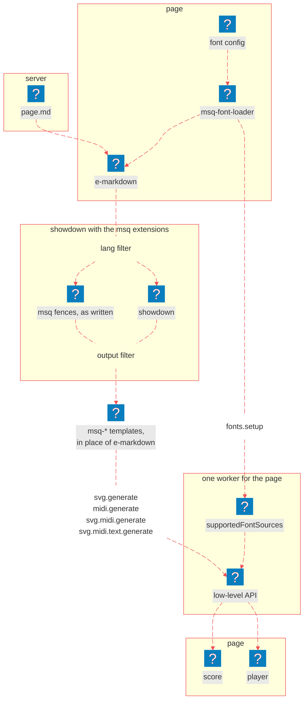

# With EHTML

<nav is="docs-contents"></nav>

## How It Works

1. [EHTML](https://github.com/Guseyn/EHTML) has `<e-markdown>`. It's an element that fetches a markdown file, converts it with showdown, and replaces itself with the result. With the [showdown extensions](/docs/showdown/overview), a markdown file with music becomes a page with scores, and you don't need to build anything. These docs are made exactly this way.
2. You don't need to write any code. EHTML activates the page once `#ehtml/main` is loaded. Anything that is added to the page later, like the content of a font loader, is activated as soon as it appears.
3. If you put `<e-markdown>` inside of `<msq-font-loader>`, it starts only when the fonts are ready. So every score in the markdown has its fonts.
4. `msqExtensions({ fontSources: 'myFonts' })` in the `data-internal-state` attribute adds `data-font-sources="myFonts"` to every element, and the font loader around `<e-markdown>` registers fonts with `data-font-sources-reference="myFonts"`. So both names must be the same. More about that you can read in [Showdown Extensions](/docs/showdown/overview#how-it-works).

Below is a diagram of how a markdown file becomes a page with scores:

1. `<msq-font-loader>` loads the fonts from its **font config** into the worker with the `fonts.setup` message, and only then puts its content, `<e-markdown>`, on the page.
2. `<e-markdown>` fetches the **markdown** file.
3. **Showdown**, with the msq extensions, turns it into HTML: the `lang` filter takes the **msq fences** out, showdown converts everything else, and the `output` filter puts each fence back as a `<template is="msq-…">`.
4. `<e-markdown>` replaces itself with that HTML.
5. From there it's the same as on the [Web Components](/docs/components/overview#how-it-works) page: every template sends its **MSQ text** to the worker with its own message, the worker runs the **low-level API**, and the element puts the **score**, the **player** or both into its own page



## Setup and a Full Example

<details is="e-details">
<summary>Setup</summary>

First, download MuSemantiQ and EHTML next to your project. EHTML carries showdown as an ES module, so you don't need to download it separately:

```sh
# download MuSemantiQ as a zip
curl -L https://github.com/Guseyn/MuSemantiQ/archive/refs/heads/main.zip -o MuSemantiQ.zip
# unpack it
unzip MuSemantiQ.zip
# name the folder MuSemantiQ
mv MuSemantiQ-main MuSemantiQ
# download EHTML as a zip
curl -L https://github.com/Guseyn/EHTML/archive/refs/heads/master.zip -o EHTML.zip
# unpack it
unzip EHTML.zip
# name the folder EHTML
mv EHTML-master EHTML
```

Then set up the web components and the extensions: the worker, the components, the language, the fonts and `showdown-extensions`:

```sh
# go to your project
cd your-project
# make the folder for MSQ in your static js folder
mkdir -p static/js/msq
# generate the worker: src, with every #msq/… import made relative
node ../MuSemantiQ/scripts/create-msq-worker.js -o static/js/msq/worker
# copy the components next to the worker
rsync -a --delete ../MuSemantiQ/web-components/ static/js/msq/web-components
# copy the language, which the editor parses with on the page
rsync -a --delete ../MuSemantiQ/src/language/ static/js/msq/language
# copy the font files; the glyph tables are already in the worker
rsync -a --delete --exclude music-js ../MuSemantiQ/src/drawer/font/ static/font
# copy the showdown extensions next to the components
rsync -a --delete ../MuSemantiQ/showdown-extensions/ static/js/msq/showdown-extensions
```

Copy EHTML into your static `js` folder. It already carries showdown, in `static/js/ehtml/showdown/`:

```sh
# copy EHTML, showdown included
rsync -a --delete ../EHTML/src/ static/js/ehtml
```

Finally, create the font config, `static/js/font-config.json`, the same one the web components use:

```json
{
  "chord-letters": {
    "gentium plus": "/font/chord-letters/GentiumPlus-Regular.ttf"
  },
  "text": {
    "noto-serif": {
      "regular": "/font/text/NotoSerif-Regular.ttf",
      "bold": "/font/text/NotoSerif-Bold.ttf"
    }
  },
  "music": {
    "bravura": {
      "font": "/font/music/Bravura.otf",
      "js": "/js/msq/worker/drawer/font/music-js/bravura.js"
    }
  }
}
```

</details>

<details is="e-details">
<summary>Full Example</summary>

```html
<!-- static/index.html -->
<!DOCTYPE html>
<html lang="en">
  <head>
    <meta charset="utf-8">
    <title>A Short Piece</title>
    <!-- one import map for EHTML and the components -->
    <script type="importmap">
      {
        "imports": {
          "#ehtml/": "/js/ehtml/",
          "#ehtml/main": "/js/ehtml/main.js",
          "#msq/web-components/": "/js/msq/web-components/",
          "#msq/language/": "/js/msq/language/"
        }
      }
    </script>
    <script type="module">
      // EHTML first; it also loads the polyfill Safari needs for <template is="…">
      import '#ehtml/main'

      // the elements the markdown may use
      import '#msq/web-components/msq-font-loader-template.js'
      import '#msq/web-components/msq-svg-template.js'
      import '#msq/web-components/msq-midi-template.js'
      import '#msq/web-components/msq-svg-midi-template.js'
      import '#msq/web-components/msq-editor-template.js'

      // the extensions, as a global, for the data-internal-state attribute
      import msqExtensions from '/js/msq/showdown-extensions/msqExtensions.js'
      window.msqExtensions = msqExtensions
    </script>
  </head>
  <body>
    <!-- load the fonts under the name myFonts, then show what is inside -->
    <template
      is="msq-font-loader"
      data-font-sources-reference="myFonts"
      data-font-config-src="/js/font-config.json"
    >
      <!-- fetch the markdown and render it with the extensions -->
      <e-markdown
        data-src="/md/page.md"
        data-internal-state="${{
          extensions: [
            msqExtensions({ fontSources: 'myFonts' })
          ]
        }}"
      ></e-markdown>
    </template>
  </body>
</html>
```

</details>

Let's say, this is the markdown it fetches, `static/md/page.md`:

````markdown
 # A Short Piece

 Here it is:

 ```msq-svg-midi file-name=a-short-piece
 measure
 treble clef
 c d e f g
 ```
````

Serve `static/` with any static server, and open http://localhost:8080:

```sh
# serve static/ on port 8080; npx fetches http-server the first time
npx http-server static -p 8080
```

As a result, you will get:

```msq-svg-midi file-name=a-short-piece
measure
treble clef
c d e f g
```

## Elements and Imports

### 1. The Imports

```html
<script type="module">
  import '#ehtml/main'
  import '#msq/web-components/msq-font-loader-template.js'
  import '#msq/web-components/msq-svg-midi-template.js'
  import msqExtensions from '/js/msq/showdown-extensions/msqExtensions.js'
  window.msqExtensions = msqExtensions
</script>
```

<details is="e-details">
<summary>Purpose</summary>

Everything the page uses. EHTML goes first, because it also loads the polyfill that Safari needs for `<template is="…">`, so you don't need to import it yourself.

</details>

<details is="e-details">
<summary>Parts</summary>

`#ehtml/main`: first; it loads the polyfill, and the components see that it's already loaded and don't load their own copy.

```js
import '#ehtml/main'
```

`msq-*-template.js`: the components the markdown uses; a component that is not imported stays an invisible `<template>`.

```js
import '#msq/web-components/msq-svg-midi-template.js'
```

`window.msqExtensions`: the extensions, as a global, for the `data-internal-state` attribute. `<e-markdown>` reads it only when it renders, and inside a font loader that happens after the fonts are loaded, so by then it's already there.

```js
window.msqExtensions = msqExtensions
```

</details>

<details is="e-details">
<summary>Result</summary>

- a page where every `<e-markdown>` renders, and every score in it waits for its fonts without any code of yours.

</details>

### 2. `<e-markdown>`

```html
<e-markdown data-src data-internal-state data-actions-on-progress-start data-actions-on-progress-end></e-markdown>
```

<details is="e-details">
<summary>Purpose</summary>

Fetches a markdown file, renders it with showdown and the extensions you give it, and replaces itself with the result. Inside a `<msq-font-loader>`, it does not even start until the fonts are ready.

</details>

<details is="e-details">
<summary>Attributes</summary>

`data-src` attribute: the URL of the markdown file; required, and it can be an expression.

```html
data-src="/md/page.md"
```

`data-internal-state` attribute: an expression whose `extensions` are given to showdown; an expression sees only globals, which is why `msqExtensions` is assigned to `window`.

```html
data-internal-state="${{
  extensions: [
    msqExtensions({ fontSources: 'myFonts' })
  ]
}}"
```

`data-actions-on-progress-start` and `data-actions-on-progress-end` attributes: code to run before the file is fetched and after it is rendered.

```html
data-actions-on-progress-end="document.title = document.querySelector('h1').textContent"
```

</details>

<details is="e-details">
<summary>Renders</summary>

- the HTML of the markdown, in its place, with every fence named after a component turned into that component.
- a jump to the heading named in the URL's `#hash`, if there is one, once it is rendered.

</details>

### 3. showdownHighlight

```js
import showdownHighlight from '#ehtml/showdown/extensions/highlight.js'
window.showdownHighlight = showdownHighlight
```

<details is="e-details">
<summary>Purpose</summary>

Highlights the code blocks of the markdown. It ships with EHTML and goes into the same list as `msqExtensions`, which is what these docs do.

</details>

<details is="e-details">
<summary>Arguments</summary>

`auto_detection`: whether to guess the language of a fence that names none; turn it off if your unnamed fences are MSQ, which it would guess wrong.

```html
data-internal-state="${{
  extensions: [
    msqExtensions({ fontSources: 'myFonts' }),
    showdownHighlight({ auto_detection: false })
  ]
}}"
```

</details>

<details is="e-details">
<summary>Returns</summary>

A showdown extension:

- every fence that names a language, such as `js` or `html`, comes out highlighted; the `msq-*` fences are left to `msqExtensions`.

</details>

Read next: [Browser app](/docs/examples/browser-app)
