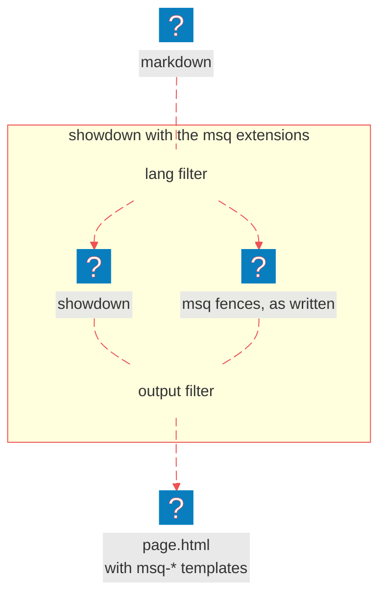
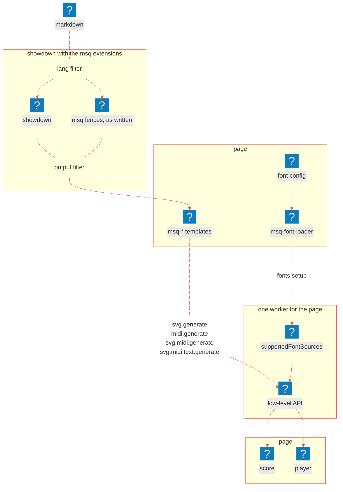

# Showdown Extensions

<nav is="docs-contents"></nav>

## How It Works

1. If you name a code block after a web component, for example `msq-svg-midi`, it becomes that component. The music goes inside of it, and the words after the name become its attributes.
2. The music inside of a code block doesn't go through markdown at all. Otherwise markdown would break it: it would split it at empty lines, add `<br>` between lines, and turn lines that start with `-` or `#` into lists and headings. So the music gets into the element exactly as you wrote it.
3. The extensions don't import showdown. They are just plain objects that showdown calls, so you can use them with any copy of showdown, in the browser and in Node.js.
4. As a result, you get HTML with `<template is="msq-…">` elements in it. They are rendered only on a page with the [web components](/docs/components/overview).
5. The extensions don't load fonts. `msqExtensions({ fontSources: 'myFonts' })` just adds `data-font-sources="myFonts"` to every element, except `<msq-midi>`, which doesn't need fonts. Fonts are loaded by `<msq-font-loader>` from its font config, with `data-font-sources-reference="myFonts"`. So both names must be the same.

<e-tabs>

<e-tab data-title="Node.js">

Below is a diagram of how a markdown file becomes an HTML file:

1. The `lang` filter runs before showdown parses anything: it takes every **msq fence** out of the **markdown**, as written, and leaves a placeholder in its place.
2. **Showdown** converts everything else into HTML.
3. The `output` filter runs after it: it puts each fence back in place of its placeholder, as a `<template is="msq-…">` with the music inside and with the `data-font-sources` attribute set to the name you gave the extensions.
4. You get **HTML** with `<template is="msq-…">` in it, which draws on any page with the web components and a font loader of the same name.



</e-tab>

<e-tab data-title="Browser">

Below is a diagram of how a markdown file becomes a page with scores:

1. The `lang` filter runs before showdown parses anything: it takes every **msq fence** out of the **markdown**, as written, and leaves a placeholder in its place.
2. **Showdown** converts everything else into HTML.
3. The `output` filter runs after it: it puts each fence back in place of its placeholder, as a `<template is="msq-…">` with the music inside and with the `data-font-sources` attribute set to the name you gave the extensions.
4. On the page, the templates sit inside a `<msq-font-loader>`, which loads the fonts from its **font config** into the worker with the `fonts.setup` message, under the same name, and only then puts the templates on the page.
5. From there it's the same as on the [Web Components](/docs/components/overview#how-it-works) page: every template sends its **MSQ text** to the worker with its own message, the worker runs the **low-level API**, and the element puts the **score**, the **player** or both into its own shadow root.



</e-tab>

</e-tabs>

## Setup and a Full Example

<e-tabs data-apply-hash-navigation>

<e-tab data-title="Node.js">

<details is="e-details">
<summary>Setup</summary>

First, download MuSemantiQ and EHTML next to your project. EHTML carries showdown as an ES module, so you don't need to download it separately:

```sh
# download MuSemantiQ as a zip
curl -L https://github.com/Guseyn/MuSemantiQ/archive/refs/heads/main.zip -o MuSemantiQ.zip
# unpack it
unzip MuSemantiQ.zip
# name the folder MuSemantiQ
mv MuSemantiQ-main MuSemantiQ
# download EHTML as a zip
curl -L https://github.com/Guseyn/EHTML/archive/refs/heads/master.zip -o EHTML.zip
# unpack it
unzip EHTML.zip
# name the folder EHTML
mv EHTML-master EHTML
```

Then copy the extensions and showdown into your project:

```sh
# go to your project
cd your-project
# make the folder for MSQ
mkdir msq
# copy the showdown extensions
rsync -a --delete ../MuSemantiQ/showdown-extensions/ msq/showdown-extensions
# copy showdown out of EHTML
rsync -a --delete ../EHTML/src/showdown/ showdown
```

Finally, mark the package as a module in your `package.json`, because the extensions are ES modules:

```json
{
  "type": "module"
}
```

</details>

<details is="e-details">
<summary>Full Example</summary>

```js
// render.js
import fs from 'fs'
// showdown, copied out of EHTML
import * as showdown from './showdown/showdown.js'
// the four msq extensions
import msqExtensions from './msq/showdown-extensions/msqExtensions.js'

// a converter that turns msq fences into elements; 'myFonts' is only a name here,
// written on every element: the page that shows this HTML loads the fonts under it
const converter = new showdown.Converter({
  extensions: [ msqExtensions({ fontSources: 'myFonts' }) ]
})

// read the markdown
const markdown = fs.readFileSync('page.md', 'utf-8')
// convert it
const html = converter.makeHtml(markdown)

// write the HTML, and print it
fs.writeFileSync('page.html', html)
console.log(html)
```

</details>

Let's say, this is the markdown it reads, `page.md`:

````markdown
 # A Short Piece

 Here it is:

 ```msq-svg-midi file-name=a-short-piece
 measure
 treble clef
 c d e f
 ```
````

Run the script:

```sh
# run the script from the root of your project
node render.js
```

As a result, you will get `page.html`, where the fence is now the element:

```html
<h1 id="ashortpiece">A Short Piece</h1>
<p>Here it is:</p>
<template is="msq-svg-midi" data-font-sources="myFonts" data-file-name="a-short-piece">
measure
treble clef
c d e f
</template>
```

It draws on a page with the [web components](/docs/components/overview), inside a font loader that registers the fonts under that same name, `myFonts`:

```html
<!-- load the fonts under the name myFonts, then show the HTML from page.html -->
<template is="msq-font-loader" data-font-sources-reference="myFonts" data-font-config-src="/js/font-config.json">
  <template is="msq-svg-midi" data-font-sources="myFonts" data-file-name="a-short-piece">
  measure
  treble clef
  c d e f
  </template>
</template>
```

</e-tab>

<e-tab data-title="Browser">

<details is="e-details">
<summary>Setup</summary>

First, download MuSemantiQ and EHTML next to your project. EHTML carries showdown as an ES module, so you don't need to download it separately:

```sh
# download MuSemantiQ as a zip
curl -L https://github.com/Guseyn/MuSemantiQ/archive/refs/heads/main.zip -o MuSemantiQ.zip
# unpack it
unzip MuSemantiQ.zip
# name the folder MuSemantiQ
mv MuSemantiQ-main MuSemantiQ
# download EHTML as a zip
curl -L https://github.com/Guseyn/EHTML/archive/refs/heads/master.zip -o EHTML.zip
# unpack it
unzip EHTML.zip
# name the folder EHTML
mv EHTML-master EHTML
```

Then set up the web components: the worker, the components, the language and the fonts. More about each step you can read in [Web Components](/docs/components/overview):

```sh
# go to your project
cd your-project
# make the folder for MSQ in your static js folder
mkdir -p static/js/msq
# generate the worker: src, with every #msq/… import made relative
node ../MuSemantiQ/scripts/create-msq-worker.js -o static/js/msq/worker
# copy the components next to the worker
rsync -a --delete ../MuSemantiQ/web-components/ static/js/msq/web-components
# copy the language, which the editor parses with on the page
rsync -a --delete ../MuSemantiQ/src/language/ static/js/msq/language
# copy the font files; the glyph tables are already in the worker
rsync -a --delete --exclude music-js ../MuSemantiQ/src/drawer/font/ static/font
```

Copy the extensions next to them, and showdown:

```sh
# copy the showdown extensions next to the components
rsync -a --delete ../MuSemantiQ/showdown-extensions/ static/js/msq/showdown-extensions
# copy showdown out of EHTML
rsync -a --delete ../EHTML/src/showdown/ static/js/showdown
```

Finally, create the font config, `static/js/font-config.json`. It's the same one the web components use:

```json
{
  "chord-letters": {
    "gentium plus": "/font/chord-letters/GentiumPlus-Regular.ttf"
  },
  "text": {
    "noto-serif": {
      "regular": "/font/text/NotoSerif-Regular.ttf",
      "bold": "/font/text/NotoSerif-Bold.ttf"
    }
  },
  "music": {
    "bravura": {
      "font": "/font/music/Bravura.otf",
      "js": "/js/msq/worker/drawer/font/music-js/bravura.js"
    }
  }
}
```

</details>

<details is="e-details">
<summary>Full Example</summary>

```html
<!-- static/index.html -->
<!DOCTYPE html>
<html lang="en">
  <head>
    <meta charset="utf-8">
    <title>A Short Piece</title>
    <!-- the #msq/… specifiers the components import each other through -->
    <script type="importmap">
      {
        "imports": {
          "#msq/web-components/": "/js/msq/web-components/",
          "#msq/language/": "/js/msq/language/"
        }
      }
    </script>
  </head>
  <body>
    <!-- where the page goes -->
    <article></article>

    <script type="module">
      // the elements the markdown uses
      import '#msq/web-components/msq-font-loader-template.js'
      import '#msq/web-components/msq-svg-midi-template.js'

      // showdown and the msq extensions
      import * as showdown from '/js/showdown/showdown.js'
      import msqExtensions from '/js/msq/showdown-extensions/msqExtensions.js'

      // a converter that turns msq fences into elements; 'myFonts' is the name
      // the font loader below registers the fonts under
      const converter = new showdown.Converter({
        extensions: [ msqExtensions({ fontSources: 'myFonts' }) ]
      })

      // fetch the markdown
      const markdown = await (await fetch('/md/page.md')).text()

      // a font loader, so every score waits for the fonts
      const loader = document.createElement('template', { is: 'msq-font-loader' })
      // it registers the fonts under myFonts, the name the converter wrote on every element
      loader.setAttribute('data-font-sources-reference', 'myFonts')
      loader.setAttribute('data-font-config-src', '/js/font-config.json')
      // the converted markdown goes inside it
      loader.innerHTML = converter.makeHtml(markdown)
      // put it on the page
      document.querySelector('article').appendChild(loader)
    </script>
  </body>
</html>
```

</details>

Let's say, this is the markdown it fetches, `static/md/page.md`:

````markdown
 # A Short Piece

 Here it is:

 ```msq-svg-midi file-name=a-short-piece
 measure
 treble clef
 c d e f
 ```
````

Serve `static/` with any static server, and open http://localhost:8080:

```sh
# serve static/ on port 8080; npx fetches http-server the first time
npx http-server static -p 8080
```

As a result, you will get:

```msq-svg-midi file-name=a-short-piece
measure
treble clef
c d e f g
```

</e-tab>

</e-tabs>

## Extensions

### 1. msqExtensions

```js
import msqExtensions from './msq/showdown-extensions/msqExtensions.js'

msqExtensions({ fontSources, ...attributes })
```

<details is="e-details">
<summary>Purpose</summary>

All four extensions at once: `msq-svg`, `msq-midi`, `msq-svg-midi` and `msq-editor` fences all become their elements. Most pages want this one and nothing else.

</details>

<details is="e-details">
<summary>Arguments</summary>

`fontSources`: the name a `<msq-font-loader>` registered its fonts under, written as the `data-font-sources` attribute on every element except `<msq-midi>`, which does not need fonts.

```js
{ fontSources: 'myFonts' }
```

`...attributes`: any other default attribute of every element, named without `data-` and in camel case if you like.

```js
{ fontSources: 'myFonts', soundFont: '/magenta-sound-font/FluidR3_GM' }
```

</details>

<details is="e-details">
<summary>Returns</summary>

An array of showdown extensions:

- two per element: a `lang` one that takes the fences out before showdown parses anything, and an `output` one that puts the elements back after.

</details>

### 2. msqSvg, msqMidi, msqSvgMidi, msqEditor

```js
import msqSvg from './msq/showdown-extensions/msqSvg.js'
import msqMidi from './msq/showdown-extensions/msqMidi.js'
import msqSvgMidi from './msq/showdown-extensions/msqSvgMidi.js'
import msqEditor from './msq/showdown-extensions/msqEditor.js'

msqSvg({ fontSources, ...attributes })
msqMidi({ ...attributes })
msqSvgMidi({ fontSources, ...attributes })
msqEditor({ fontSources, ...attributes })
```

<details is="e-details">
<summary>Purpose</summary>

One element each, for a page that should turn only some fences into components and leave the rest alone.

</details>

<details is="e-details">
<summary>Arguments</summary>

`fontSources`: the name a `<msq-font-loader>` registered its fonts under; `msqMidi` has none.

```js
{ fontSources: 'myFonts' }
```

`...attributes`: any other default attribute of that element.

```js
{ fontSources: 'myFonts', opensWith: 'text' }
```

</details>

<details is="e-details">
<summary>Returns</summary>

An array of showdown extensions:

- the same `lang` and `output` pair as above, for that element only; a `msq-svg` fence is never mistaken for `msq-svg-midi`.

</details>

### 3. The Fence

````markdown
 ```msq-editor opens-with=text file-name="a short piece" data-editor-height=320px
 measure
 treble clef
 c d e f
 ```
````

<details is="e-details">
<summary>Purpose</summary>

How a component is written in markdown: the name of the element after the backticks, its attributes after the name, the music inside.

</details>

<details is="e-details">
<summary>Parts</summary>

`msq-editor`: the name of the element; `msq-svg`, `msq-midi`, `msq-svg-midi` or `msq-editor`, and any other name is left to showdown as a plain code block.

```text
msq-svg | msq-midi | msq-svg-midi | msq-editor
```

`opens-with=text`: an attribute, `key=value`, `key="value with spaces"` or a bare `key`, with `data-` added unless it is already there.

```text
opens-with=text  →  data-opens-with="text"
```

The music: exactly what is between the fences, escaped for HTML and nothing else.

```text
measure
treble clef
c d e f
```

</details>

<details is="e-details">
<summary>Becomes</summary>

- one `<template is="…">` with the defaults of the extension, overridden by the attributes of the fence, and the music as its content.

</details>

Read next: [With EHTML](/docs/ehtml/overview)
