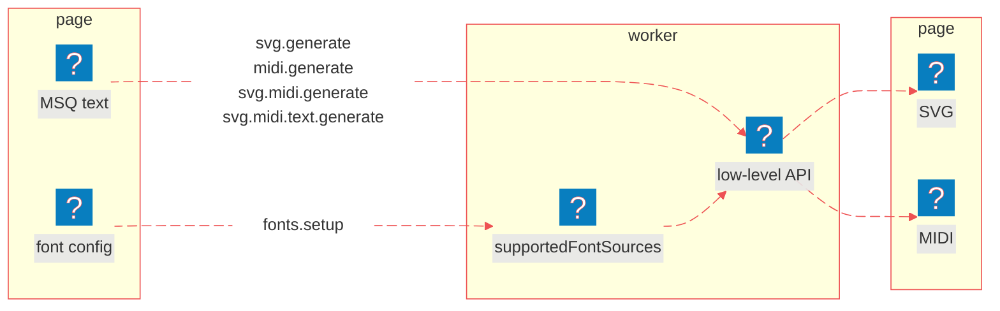

# Worker

<nav is="docs-contents"></nav>

## How It Works

1. The worker runs in a separate thread, so the page doesn't freeze while fonts are loading and scores are rendering.
2. The page and the worker talk to each other only with messages. Each message is an object with a `name`, an `id` and its own fields. The worker replies with the same `id` and with `status: 'ok'`, or with an `error` if something went wrong. If the worker doesn't know the `name`, it doesn't reply at all.
3. You load fonts only once, with the `fonts.setup` message, and you give them a name. Then you just use this name in other messages.
4. Inside, the worker uses the same [Low-Level API](/docs/api/overview#how-it-works), so you don't need to load it on the page.

Below is a diagram of how the page and the worker communicate:

1. The page sends the **font config** with the `fonts.setup` message, and the worker loads the fonts and keeps them as **supported font sources**, under the name the page picked.
2. The page sends the **MSQ text** with one of the messages that generate a score, together with that name.
3. The worker runs the **low-level API** on the text with those fonts.
4. The worker sends back **SVG**, **MIDI**, or both.



## Setup and a Full Example

<details is="e-details">
<summary>Setup</summary>

First, download MuSemantiQ next to your project:

```sh
# download MuSemantiQ as a zip
curl -L https://github.com/Guseyn/MuSemantiQ/archive/refs/heads/main.zip -o MuSemantiQ.zip
# unpack it
unzip MuSemantiQ.zip
# name the folder MuSemantiQ
mv MuSemantiQ-main MuSemantiQ
```

Then generate the worker. The script copies the whole `src` and rewrites every `#msq/…` import to a relative path, because a module worker gets no import map:

```sh
# go to your project
cd your-project
# make the folder for MSQ in your static js folder
mkdir -p static/js/msq
# generate the worker: src, with every #msq/… import made relative
node ../MuSemantiQ/scripts/create-msq-worker.js -o static/js/msq/worker
```

The worker holds only `.js` files, so copy the font files separately. The glyph tables are already in the worker, under `drawer/font/music-js/`:

```sh
# copy the font files; the glyph tables are already in the worker
rsync -a --delete --exclude music-js ../MuSemantiQ/src/drawer/font/ static/font
```

</details>

<details is="e-details">
<summary>Full Example</summary>

```html
<!-- static/index.html -->
<!DOCTYPE html>
<html lang="en">
  <head>
    <meta charset="utf-8">
    <title>A Short Piece</title>
  </head>
  <body>
    <!-- where the score goes -->
    <div id="score"></div>
    <!-- the MIDI, as a download -->
    <a id="midi" download="score.mid">Download MIDI</a>
    <!-- what the parser could not use -->
    <ul id="errors"></ul>

    <script type="module">
      // start the worker
      const worker = new Worker('/js/msq/worker/worker.js', { type: 'module' })

      // send one message, and wait for the reply with the same id
      function request(name, payload) {
        const id = crypto.randomUUID()
        return new Promise((resolve, reject) => {
          const onMessage = (event) => {
            if (event.data.id !== id) {
              return
            }
            worker.removeEventListener('message', onMessage)
            if (event.data.status === 'ok') {
              resolve(event.data)
            } else {
              reject(new Error(event.data.error))
            }
          }
          worker.addEventListener('message', onMessage)
          worker.postMessage({ id, name, ...payload })
        })
      }

      // load the fonts into the worker, under the name myFonts
      await request('fonts.setup', {
        fontSourcesReference: 'myFonts',
        fontConfig: {
          'chord-letters': {
            'gentium plus': '/font/chord-letters/GentiumPlus-Regular.ttf'
          },
          'text': {
            'noto-serif': {
              'regular': '/font/text/NotoSerif-Regular.ttf',
              'bold': '/font/text/NotoSerif-Bold.ttf'
            }
          },
          'music': {
            'bravura': {
              'font': '/font/music/Bravura.otf',
              'js': '/js/msq/worker/drawer/font/music-js/bravura.js'
            }
          }
        }
      })

      // engrave and perform one page with those fonts
      const { svg, midiDataSrc, errors } = await request('svg.midi.generate', {
        fontSourcesReference: 'myFonts',
        inputText: `
          title is "A Short Piece"

          measure
          treble clef
          c d e f
        `
      })

      // show the score, link the MIDI and list the errors
      document.querySelector('#score').innerHTML = svg
      document.querySelector('#midi').href = midiDataSrc
      for (const error of errors) {
        const item = document.createElement('li')
        item.textContent = error
        document.querySelector('#errors').appendChild(item)
      }
    </script>
  </body>
</html>
```

</details>

Serve `static/` with any static server, and open http://localhost:8080:

```sh
# serve static/ on port 8080; npx fetches http-server the first time
npx http-server static -p 8080
```

As a result, the page will show the music score, offer the MIDI file as a download, and list the lines the parser could not use, if there are any.

## Messages

### 1. fonts.setup

```js
worker.postMessage({ id, name: 'fonts.setup', fontConfig, fontSourcesReference })
```

<details is="e-details">
<summary>Purpose</summary>

Loads the fonts once, inside the worker, and keeps them under a name that every later message refers to. A name can be registered only once, and the fonts stay until the page is closed.

</details>

<details is="e-details">
<summary>Fields</summary>

`id`: any string that is unique among the messages waiting for a reply.

```js
crypto.randomUUID()
```

`fontConfig`: the fonts by name, as in [setupFonts](/docs/api/overview#1-setupfonts), with every entry a URL and all three categories given.

```js
{
  'chord-letters': { 'gentium plus': '/font/chord-letters/GentiumPlus-Regular.ttf' },
  'text': { 'noto-serif': { regular: '/font/text/NotoSerif-Regular.ttf', bold: '/font/text/NotoSerif-Bold.ttf' } },
  'music': { 'bravura': { font: '/font/music/Bravura.otf', js: '/js/msq/worker/drawer/font/music-js/bravura.js' } }
}
```

`fontSourcesReference`: the name the fonts are kept under.

```js
'myFonts'
```

</details>

<details is="e-details">
<summary>Reply</summary>

- `id`: the id of the message.
- `status`: **ok** once every font has loaded.
- `error`, instead of `status`: why not, for example `Font sources are already registered under reference (myFonts)`.

</details>

### 2. svg.generate

```js
worker.postMessage({ id, name: 'svg.generate', fontSourcesReference, inputText })
```

<details is="e-details">
<summary>Purpose</summary>

Parses and engraves one page. Nothing is played, so nothing is heard, which is sometimes exactly what you want.

</details>

<details is="e-details">
<summary>Fields</summary>

`fontSourcesReference`: the name a `fonts.setup` message registered the fonts under.

```js
'myFonts'
```

`inputText`: the MSQ text of one page; every line is parsed as it is, indented or not.

```js
'measure\ntreble clef\nc d e f'
```

</details>

<details is="e-details">
<summary>Reply</summary>

- `svg`: the score, as SVG markup.
- `svgDataSrc`: the same score as a `data:image/svg+xml;base64,…` URL, for an `` or a download link.
- `errors`: one string per line the parser could not use; the score is drawn from the rest.

</details>

### 3. midi.generate

```js
worker.postMessage({ id, name: 'midi.generate', inputText })
```

<details is="e-details">
<summary>Purpose</summary>

Parses and performs one page. It is the only message that needs no fonts, so it takes no reference and can be sent before the `fonts.setup` message.

</details>

<details is="e-details">
<summary>Fields</summary>

`inputText`: the MSQ text of one page.

```js
'default tempo is "1/4 = 96"\nmeasure\ntreble clef\nc d e f'
```

</details>

<details is="e-details">
<summary>Reply</summary>

- `midiDataSrc`: the MIDI file as a base64 data URL, which a player or a download link can take as it is.
- `errors`: one string per line the parser could not use.

</details>

### 4. svg.midi.generate

```js
worker.postMessage({ id, name: 'svg.midi.generate', fontSourcesReference, inputText })
```

<details is="e-details">
<summary>Purpose</summary>

Engraves and performs one page from a single parse, and links the two, so a score can follow its own playback.

</details>

<details is="e-details">
<summary>Fields</summary>

`fontSourcesReference`: the name a `fonts.setup` message registered the fonts under.

```js
'myFonts'
```

`inputText`: the MSQ text of one page.

```js
'measure\ntreble clef\nc d e f'
```

</details>

<details is="e-details">
<summary>Reply</summary>

- `svg`: the score, as SVG markup, with a `ref-ids` attribute on every drawn element.
- `svgDataSrc`: the same score as a base64 data URL.
- `midiDataSrc`: the MIDI file as a base64 data URL.
- `timeStampsMappedWithRefsOn`: for each moment in seconds, the ref ids that start sounding then, and for how long.
- `refsOnMappedWithTimeStamps`: for each ref id, the moment it starts, under page index **0**.
- `customStyles`: the style commands of the page, as written, for example to read its colours.
- `errors`: one string per line the parser could not use.

</details>

### 5. svg.midi.text.generate

```js
worker.postMessage({ id, name: 'svg.midi.text.generate', fontSourcesReference, inputText })
```

<details is="e-details">
<summary>Purpose</summary>

Everything the `svg.midi.generate` message does, plus the source text highlighted with the same ref ids, so the text, the score and the playback all point at each other. This is what the editor sends.

</details>

<details is="e-details">
<summary>Fields</summary>

`fontSourcesReference`: the name a `fonts.setup` message registered the fonts under.

```js
'myFonts'
```

`inputText`: the MSQ text of one page.

```js
'measure\ntreble clef\nc d e f'
```

</details>

<details is="e-details">
<summary>Reply</summary>

- `svg`, `svgDataSrc`, `midiDataSrc`, `timeStampsMappedWithRefsOn`, `refsOnMappedWithTimeStamps`, `customStyles`, `errors`: the same as in the `svg.midi.generate` message.
- `highlightsHtmlBuffer`: the source as an array of HTML fragments, every token in a `<span>` with a `ref-id`; `join('')` it before use.

</details>

### 6. glyph.trace

```js
worker.postMessage({ id, name: 'glyph.trace', fontSourcesReference, musicFontName, characters, musicFontSourceSize, intervalBetweenStaveLines })
```

<details is="e-details">
<summary>Purpose</summary>

Traces characters of a loaded music font into path points. The font viewer in the dev tools uses it, and you probably won't, but it's there.

</details>

<details is="e-details">
<summary>Fields</summary>

`fontSourcesReference`: the name a `fonts.setup` message registered the fonts under.

```js
'myFonts'
```

`musicFontName`: a music font loaded under that name.

```js
'bravura'
```

`characters`: the characters to trace, usually SMuFL code points.

```js
''
```

`musicFontSourceSize`: the font size in intervals between stave lines; the engine uses **4**.

```js
4
```

`intervalBetweenStaveLines`: the interval between stave lines, in SVG units.

```js
8.5
```

</details>

<details is="e-details">
<summary>Reply</summary>

- `points`: the outline as a flat list of SVG path commands and their coordinates, moved to the top left corner.
- `missingCharacters`: the characters the font does not have; when there are any, `points` is empty.

</details>

Read next: [Web Components](/docs/components/overview)
